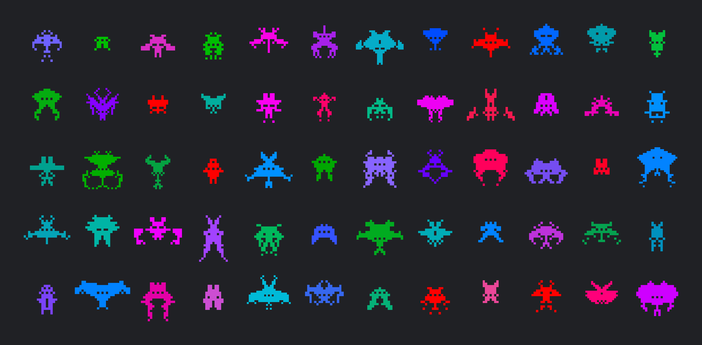

# Space Invaders

[https://muffinman.io/invaders/](https://muffinman.io/invaders/)

Check [the interactive blog post](https://muffinman.io/blog/invaders/) to see how it works.

A Space Invaders generator I made for Creative Coding Amsterdam [code challenge](https://cca.codes/invaders.html).

## Development

- Install dependencies: `npm install`
- Run development server: `npm start`
- Open in browser: `http://localhost:1234`

# TODO (aka wishlist)

- Polish tentacle and horn generation
- More eyes
- Hardcoded elements (specific horns and ornaments)
- Five tentacles options for large ones
- Mock the game screen with rows of invaders
- Animate generation process
- Handle out of bounds tentacles
- Expose even more parameters
